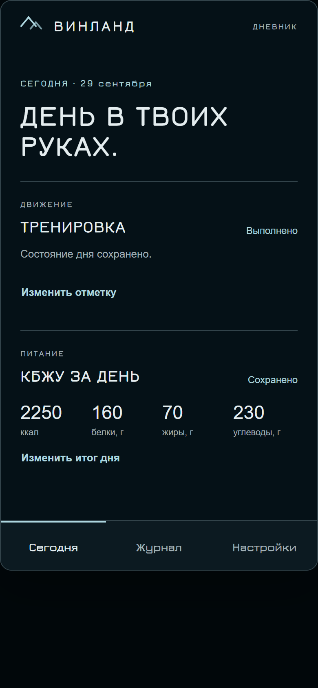
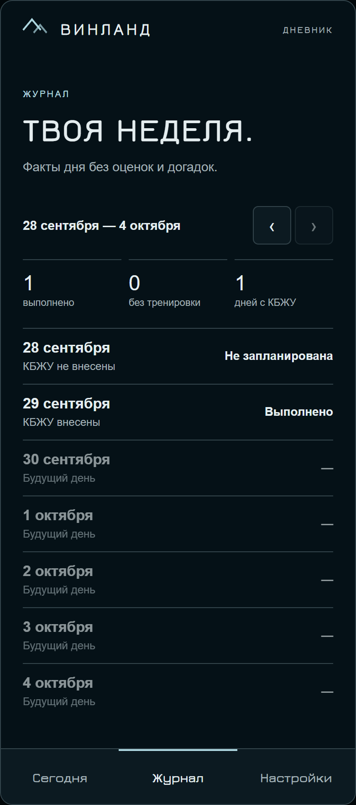

# ВИНЛАНД · Telegram Mini App


[](https://github.com/Halibubv/tg-bot/actions/workflows/checks.yml)

Самостоятельный Telegram Mini App-компаньон для короткой ежедневной отметки тренировки и итогов КБЖУ. Основные действия выполняются в Mini App: «Сегодня», «Журнал» и «Настройки».

Это учебный проект для портфолио и дополнение к веб-приложению ВИНЛАНД. Пока он
работает самостоятельно: синхронизация с основным сайтом — следующий этап, а не
функция, которая уже реализована.

| Сегодня | Журнал |
| :---: | :---: |
|  |  |

*Снимки сделаны в локальном demo-режиме с вымышленными данными. Личные данные и
Telegram-токен для них не использовались.*

В проекте уже есть:

- постоянное локальное хранилище SQLite и миграции;
- состояния дня: не запланирована, запланирована, выполнено, день без тренировки;
- атомарный ввод КБЖУ (ккал, белки, жиры, углеводы);
- недельный журнал с понедельника по воскресенье;
- настройки часового пояса и до двух напоминаний о запланированной тренировке;
- проверка Telegram Mini App `initData` на сервере в production;
- безопасный локальный demo-режим без Telegram-токена.

Ранние материалы о другой идее — боте для записи клиентов — сохранены в
[`archive/booking-concept`](archive/booking-concept). Они не описывают текущую реализацию.

## Быстрый локальный запуск

Нужен Node.js 24 или новее. Внешние npm-зависимости не нужны.

```powershell
git clone https://github.com/Halibubv/tg-bot.git
cd tg-bot
Copy-Item .env.example .env
node --env-file=.env src/index.js
```

На macOS/Linux вместо `Copy-Item` используйте `cp .env.example .env`.

Откройте `http://127.0.0.1:3000`. По умолчанию это `APP_MODE=demo`: сервер привязан только к loopback-адресу, не использует токен, не отправляет сообщения и хранит отдельные демонстрационные данные в `data/vinland-demo.sqlite`.

Проверки:

```bash
npm run check
```

Если npm недоступен в текущем окружении, эквивалентная команда — `node --test`.

## Production и Telegram

Реальное подключение требует собственного бота, HTTPS-домена и секретов, заданных только на сервере:

```dotenv
APP_MODE=production
TELEGRAM_BOT_TOKEN=...
WEB_APP_URL=https://your-domain.example
TELEGRAM_WEBHOOK_SECRET=...
DATA_DIRECTORY=./data
```

`POST /telegram/webhook` принимает только запросы с совпадающим секретом. Команда `/start` отправляет кнопку «Открыть ВИНЛАНД». API Mini App проверяет подпись и срок `initData`; ID из тела запроса не используется как личность пользователя.

Не добавляйте `.env`, SQLite-файлы, токены или журналы с личными данными в Git. Реальную работу с Telegram в этом репозитории можно проверить только после развёртывания на HTTPS и предоставления пользователем собственного токена — текущая разработка не входила в аккаунт Telegram и токен не использовала.

## Напоминания

Сервер раз в 15 минут ищет запланированные тренировки в локальном часовом поясе пользователя. Максимум два слота: первое время и ещё один через 12 часов, только если он попадает в тот же календарный день. После «Выполнено» или «День без тренировки» уведомления прекращаются.

Доставка использует SQLite-lease и повторяет явную сетевую ошибку. После аварии в узком промежутке между приёмом Telegram и фиксацией результата возможна повторная доставка: Telegram Bot API не предоставляет ключа идемпотентности для `sendMessage`. Смысл доставки поэтому **at-least-once**, а не ложное обещание exactly-once.

## Резервная копия и восстановление

Перед копированием остановите процесс приложения. Сохраните файл `data/vinland.sqlite` вместе с одноимёнными `-wal` и `-shm`, если они есть. Для восстановления остановите приложение, замените эти файлы резервной копией и запустите сервер снова. Проверьте восстановление сначала на копии каталога данных.

Подробности маршрутов, безопасности и будущего контракта синхронизации — в [docs/operations/vinland.md](docs/operations/vinland.md). Визуальная и продуктовая спецификация — в [docs/design/vinland/SPEC.md](docs/design/vinland/SPEC.md).
